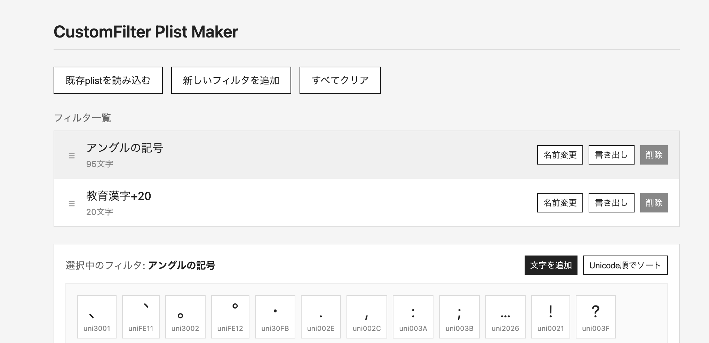

[日本語](README_JP.md)/English

# CustomFilter Plist Maker

A browser-based tool for creating and editing plist files for Glyphs3 CustomFilters.



## Live Demo

[https://toktaro.github.io/CustomFilter-Plist-Maker/](https://toktaro.github.io/CustomFilter-Plist-Maker/)

## Features

- **Multiple Filters**: Manage multiple filters in a single plist file
- **Filter Operations**: Add, edit, delete, and reorder filters via drag-and-drop
- **Character Input**: Enter text directly, paste, or drag-and-drop text files (.txt)
- **Load Existing Plist**: Import existing plist files for editing (supports multiple filters)
- **Glyph Name Support**: Handles both Unicode format (uni3042) and PostScript glyph names (space, Eth, A, etc.)
- **Unicode Sorting**: Sort registered characters by Unicode code point order
- **Automatic Deduplication**: Duplicate characters are automatically merged into one
- **Individual Character Deletion**: Hover over a character to reveal ✕ button for removal
- **Export**: Download individual filters or all filters as a single plist

## Usage

### Basic Workflow

1. Open `index.html` in your browser
2. Click "新しいフィルタを追加" (Add New Filter) to create a filter
3. Enter a filter name
4. Click "文字を追加" (Add Characters) to input characters (type text or drop a .txt file)
5. Add more filters as needed
6. Click "すべてを1つのplistとしてダウンロード" (Download All as One Plist) to save

### Editing Existing Plist Files

1. Click "既存plistを読み込む" (Load Existing Plist) to select a plist file
2. If the file contains multiple filters, all of them will be added to the list
3. Select each filter to edit
4. Export when finished

### Individual Export

Click the "書き出し" (Export) button on each filter to download it as a separate plist file.  
The filename will be formatted as "OriginalFileName-FilterName.plist".

### Using with Glyphs3

Place the downloaded plist file in the same directory as your .glyphs file,  
or in the following directory:

```
~/Library/Application Support/Glyphs 3/Filters/
```

Restart Glyphs3 and the filter will appear in the sidebar under Filters.

## Technical Specifications

- **Requirements**: Modern browsers (Chrome, Safari, Firefox, Edge)
- **Dependencies**: None (no framework used)
- **File Format**: Single HTML file (CSS & JavaScript embedded)

### Glyph Name Format

Characters entered are converted to Unicode format. When loading a plist, glyph names are preserved as-is:

| Input | Stored Glyph Name | Notes |
|-------|-------------------|-------|
| 茨 | uni8328 | Character input → converted to Unicode format |
| あ | uni3042 | |
| A | uni0041 | |
| (from plist) | space | PostScript glyph names preserved |
| (from plist) | Eth | |

## License

This project is licensed under the [GNU General Public License v3.0](LICENSE).

(c) 2026- toktaro
